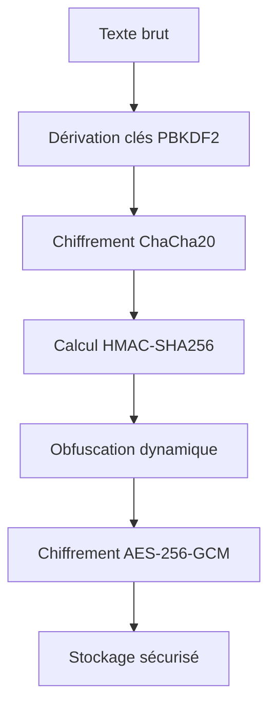

# 🔐 BlackNote.js

**Gestionnaire de notes local ultra-sécurisé**

*"When privacy matters, trust no cloud."*


## 📋 Table des matières

- [🎯 À propos](#-à-propos)
- [✨ Fonctionnalités](#-fonctionnalités)
- [🔒 Sécurité](#-sécurité)
- [🚀 Installation](#-installation)
- [💻 Utilisation](#-utilisation)
- [🧬 Algorithme de chiffrement](#-algorithme-de-chiffrement)
- [🛠️ Technologies](#️-technologies)
- [📦 Structure du projet](#-structure-du-projet)
- [🤝 Contribution](#-contribution)
- [📄 Licence](#-licence)

## 🎯 À propos

BlackNote.js est un gestionnaire de notes local révolutionnaire qui fonctionne intégralement dans votre navigateur, **sans aucun serveur ni cloud**. Conçu pour les utilisateurs qui priorisent la confidentialité absolue, il utilise un algorithme de chiffrement hybride propriétaire appelé **"Double Lock & Obfuscate"** pour garantir une sécurité maximale de vos données sensibles.

### 🌟 Pourquoi BlackNote.js ?

- **🔒 Confidentialité totale** : Vos notes ne quittent jamais votre appareil
- **🛡️ Chiffrement militaire** : Double couche ChaCha20 + AES-256-GCM
- **🧠 Zéro connaissance** : Même nous ne pouvons pas lire vos notes
- **⚡ Performance** : Interface fluide et réactive
- **🎨 Design moderne** : Interface élégante et intuitive

## ✨ Fonctionnalités

### 🔐 Sécurité avancée
- **Chiffrement double couche** : ChaCha20 + AES-256-GCM
- **Dérivation de clés robuste** : PBKDF2 avec 100 000 itérations
- **Vérification d'intégrité** : HMAC-SHA256 pour détecter les altérations
- **Obfuscation dynamique** : Brouillage des patterns cryptographiques
- **Mot de passe maître unique** : Un seul mot de passe pour toutes vos notes

### 💾 Stockage et gestion
- **100% local** : Stockage via localStorage (pas de serveur)
- **Sauvegarde/Restauration** : Export/Import de fichiers `.blacknote`
- **Gestion des tags** : Organisation avancée de vos notes
- **Recherche rapide** : Trouvez vos notes instantanément
- **Interface responsive** : Optimisé pour tous les écrans

### 🎨 Interface utilisateur
- **Design sombre élégant** : Thème professionnel axé sécurité
- **Animations fluides** : Transitions et micro-interactions
- **Éditeur avancé** : Interface d'édition intuitive
- **Indicateurs visuels** : Statuts de chiffrement et sécurité

## 🔒 Sécurité

BlackNote.js implémente des standards de sécurité de niveau militaire :

### 🛡️ Algorithme "Double Lock & Obfuscate"

```
Texte brut → ChaCha20 → HMAC → Obfuscation → AES-256-GCM → Stockage
```

1. **Première couche** : Chiffrement ChaCha20 avec clé dérivée
2. **Intégrité** : Calcul HMAC-SHA256 pour détecter les modifications
3. **Obfuscation** : Insertion de caractères spéciaux pseudo-aléatoires
4. **Seconde couche** : Chiffrement AES-256-GCM avec authentification

### 🔑 Gestion des clés

- **Dérivation PBKDF2** : 100 000 itérations avec SHA-256
- **Sels aléatoires** : Génération cryptographiquement sécurisée
- **Séparation des clés** : Clés distinctes pour chaque couche
- **Pas de stockage** : Les clés ne sont jamais sauvegardées

### Audit de sécurité

- **Pas de dépendances vulnérables** : Audit régulier avec `npm audit`
- **Code review** : Vérification manuelle du code cryptographique
- **Tests de pénétration** : Validation de la résistance aux attaques

## 🚀 Installation

### Prérequis
- Node.js 18+ 
- npm ou yarn

### Installation locale

```bash
# Cloner le repository
git clone https://github.com/elieduclr/BlackNote.git
cd BlackNote

# Installer les dépendances
npm install

# Lancer en mode développement
npm run dev

# Build pour la production
npm run build
```

### Déploiement

```bash
# Build optimisé
npm run build

# Prévisualiser le build
npm run preview
```

## 💻 Utilisation

### Premier lancement

1. **Définir un mot de passe maître** fort et unique
2. **Créer votre première note** chiffrée
3. **Organiser avec des tags** pour une meilleure gestion

### Sauvegarde et restauration

- **Export** : Génère un fichier `.blacknote` chiffré
- **Import** : Restaure vos notes depuis une sauvegarde
- **Fusion intelligente** : Conserve les versions les plus récentes

## 🧬 Algorithme de chiffrement

### Processus de chiffrement détaillé



### Composants cryptographiques

| Composant | Algorithme | Taille clé | Utilisation |
|-----------|------------|------------|-------------|
| **Première couche** | ChaCha20 | 256 bits | Chiffrement principal |
| **Seconde couche** | AES-256-GCM | 256 bits | Chiffrement + auth |
| **Intégrité** | HMAC-SHA256 | 256 bits | Détection altération |
| **Dérivation** | PBKDF2-SHA256 | - | Génération clés |

## 🛠️ Technologies

### Frontend
- **React 18** - Interface utilisateur moderne
- **TypeScript** - Typage statique pour la fiabilité
- **Tailwind CSS** - Styling utilitaire et responsive
- **Lucide React** - Icônes élégantes et cohérentes

### Cryptographie
- **Web Crypto API** - Primitives cryptographiques natives
- **ChaCha20** - Implémentation custom en TypeScript
- **PBKDF2** - Dérivation de clés sécurisée
- **HMAC-SHA256** - Vérification d'intégrité

### Outils de développement
- **Vite** - Build tool ultra-rapide
- **ESLint** - Analyse statique du code
- **PostCSS** - Traitement CSS avancé

## 📦 Structure du projet

```
blacknote-js/
├── src/
│   ├── components/          # Composants React
│   │   ├── Header.tsx
│   │   ├── NoteCard.tsx
│   │   ├── NoteEditor.tsx
│   │   ├── MasterPasswordModal.tsx
│   │   └── EmptyState.tsx
│   ├── utils/              # Utilitaires cryptographiques
│   │   ├── crypto.ts       # Algorithme Double Lock & Obfuscate
│   │   ├── chacha20.ts     # Implémentation ChaCha20
│   │   └── storage.ts      # Gestion du stockage local
│   ├── types/              # Définitions TypeScript
│   │   └── index.ts
│   ├── App.tsx             # Composant principal
│   └── main.tsx            # Point d'entrée
├── public/                 # Assets statiques
├── package.json
└── README.md
```

## 🤝 Contribution

Les contributions sont les bienvenues ! Voici comment participer :

### Processus de contribution

1. **Fork** le projet
2. **Créer** une branche feature (`git checkout -b feature/AmazingFeature`)
3. **Commit** vos changements (`git commit -m 'Add AmazingFeature'`)
4. **Push** vers la branche (`git push origin feature/AmazingFeature`)
5. **Ouvrir** une Pull Request

### Guidelines

- **Code quality** : Respecter les standards ESLint
- **Tests** : Ajouter des tests pour les nouvelles fonctionnalités
- **Documentation** : Documenter les changements importants
- **Sécurité** : Faire auditer les modifications cryptographiques

### Domaines de contribution

- 🔒 **Sécurité** : Amélioration des algorithmes cryptographiques
- 🎨 **UI/UX** : Amélioration de l'interface utilisateur
- 📱 **Mobile** : Optimisation pour les appareils mobiles
- 🌐 **i18n** : Traductions et internationalisation
- 📚 **Documentation** : Amélioration de la documentation

## 🐛 Signaler un bug

Pour signaler un bug de sécurité, envoyez un email à : **elieducailar@gmail.com**

Pour les autres bugs, utilisez les [GitHub Issues](https://github.com/elieduclr/BlackNote/issues).

## 📈 Roadmap

### Version 2.0.0
- [ ] Mode hors ligne complet avec Service Worker
- [ ] Synchronisation P2P chiffrée
- [ ] Plugin pour navigateurs
- [ ] Application Electron

### Version 3.0.0
- [ ] Authentification biométrique
- [ ] Partage sécurisé de notes
- [ ] API pour développeurs
- [ ] Thèmes personnalisables

## 📄 Licence

Ce projet est sous licence MIT. Voir le fichier [LICENSE](LICENSE) pour plus de détails.

```
MIT License

Copyright (c) 2024 BlackNote.js

Permission is hereby granted, free of charge, to any person obtaining a copy
of this software and associated documentation files (the "Software"), to deal
in the Software without restriction, including without limitation the rights
to use, copy, modify, merge, publish, distribute, sublicense, and/or sell
copies of the Software, and to permit persons to whom the Software is
furnished to do so, subject to the following conditions:

The above copyright notice and this permission notice shall be included in all
copies or substantial portions of the Software.
```

## 🙏 Remerciements

- **ChaCha20** : Algorithme de Daniel J. Bernstein
- **AES** : Standard NIST FIPS 197
- **React Team** : Pour l'excellent framework
- **Tailwind CSS** : Pour le système de design

## 📞 Contact

- **Site de Démo** : [blacknote-demo.vercel.app](https://blacknote-demo.vercel.app)
- **Email** : elieducailar@gmail.com

---

<div align="center">

**🔐 BlackNote.js - Quand la confidentialité compte, ne faites confiance à aucun cloud.**

[](https://github.com/elieduclr/BlackNote/stargazers)
[](https://github.com/elieduclr/BlackNote/network/members)

</div>