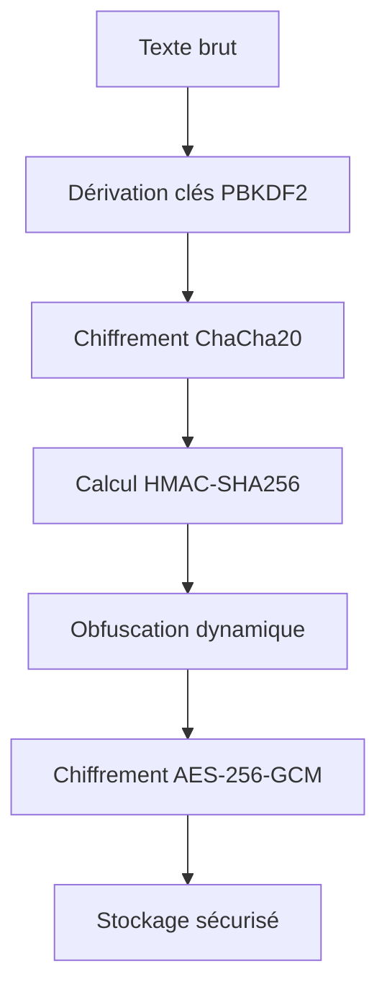

# 🔐 BlackNote.js v2.0.1

**Gestionnaire de notes local ultra-sécurisé avec mode hors ligne complet**

*"When privacy matters, trust no cloud."*


## 🚀 **Nouveautés v2.0.1**

### 📱 **Mode Hors Ligne Complet**
- **Service Worker ultra-sécurisé** : Fonctionnement 100% offline
- **PWA (Progressive Web App)** : Installation native sur tous appareils
- **Cache intelligent** : Performance optimale même sans connexion
- **Synchronisation background** : Préparation pour fonctionnalités futures

### 🔧 **Améliorations Techniques**
- **Indicateur de statut** : Monitoring temps réel du mode offline
- **Gestion des mises à jour** : Détection et installation automatique
- **Optimisations performance** : Chargement plus rapide et fluide
- **Architecture PWA** : Standards modernes du web

## 📋 Table des matières

- [🎯 À propos](#-à-propos)
- [✨ Fonctionnalités v2.0.1](#-fonctionnalités-v200)
- [🔒 Sécurité](#-sécurité)
- [📱 PWA et Mode Hors Ligne](#-pwa-et-mode-hors-ligne)
- [🚀 Installation](#-installation)
- [💻 Utilisation](#-utilisation)
- [🧬 Algorithme de chiffrement](#-algorithme-de-chiffrement)
- [🛠️ Technologies](#️-technologies)
- [📦 Structure du projet](#-structure-du-projet)
- [🤝 Contribution](#-contribution)
- [📄 Licence](#-licence)

## 🎯 À propos

BlackNote.js v2.0.1 est un gestionnaire de notes local révolutionnaire qui fonctionne intégralement dans votre navigateur, **sans aucun serveur ni cloud**. Cette nouvelle version introduit le **mode hors ligne complet** avec Service Worker, transformant BlackNote.js en véritable PWA (Progressive Web App).

### 🌟 Pourquoi BlackNote.js v2.0.1 ?

- **🔒 Confidentialité totale** : Vos notes ne quittent jamais votre appareil
- **📱 Mode hors ligne** : Fonctionnement complet sans connexion internet
- **🛡️ Chiffrement militaire** : Double couche ChaCha20 + AES-256-GCM
- **⚡ Performance native** : Installation comme application native
- **🎨 Design moderne** : Interface élégante et intuitive

## ✨ Fonctionnalités v2.0.1

### 📱 **PWA (Progressive Web App)**
- **Installation native** : Ajout à l'écran d'accueil mobile/desktop
- **Mode standalone** : Expérience application complète
- **Raccourcis d'application** : Accès rapide aux fonctions principales
- **Icônes adaptatives** : Support de tous les formats d'écrans
- **Thème système** : Intégration parfaite avec l'OS

### 🌐 **Service Worker Ultra-Sécurisé**
- **Cache intelligent** : Mise en cache automatique des ressources critiques
- **Stratégie Cache-First** : Performance optimale même hors ligne
- **Gestion des versions** : Détection et mise à jour automatique
- **Background Sync** : Préparation pour synchronisation P2P future
- **Sécurité renforcée** : Pas de données sensibles en cache

### 📊 **Indicateur de Statut Avancé**
- **Monitoring temps réel** : État réseau et Service Worker
- **Interface détaillée** : Informations complètes sur les capacités
- **Mise à jour en un clic** : Gestion des nouvelles versions
- **Indicateurs visuels** : Status colorés et animations fluides

### 🔐 **Sécurité Maintenue**
- **Chiffrement hors ligne** : Toutes les fonctions crypto disponibles
- **Double Lock & Obfuscate** : Algorithme propriétaire inchangé
- **Intégrité garantie** : Vérification des ressources mises en cache
- **Pas de compromis** : Sécurité maximale même offline

## 🔒 Sécurité

BlackNote.js v2.0.1 maintient les mêmes standards de sécurité de niveau militaire :

### 🛡️ Algorithme "Double Lock & Obfuscate" (Inchangé)

```
Texte brut → ChaCha20 → HMAC → Obfuscation → AES-256-GCM → Stockage
```

1. **Première couche** : Chiffrement ChaCha20 avec clé dérivée
2. **Intégrité** : Calcul HMAC-SHA256 pour détecter les modifications
3. **Obfuscation** : Insertion de caractères spéciaux pseudo-aléatoires
4. **Seconde couche** : Chiffrement AES-256-GCM avec authentification

### 🔐 **Sécurité PWA Renforcée**
- **Service Worker sécurisé** : Pas de données sensibles en cache
- **Ressources vérifiées** : Intégrité des fichiers mis en cache
- **Isolation complète** : Fonctionnement en sandbox sécurisé
- **Chiffrement local** : Toutes les opérations crypto restent locales

## 📱 PWA et Mode Hors Ligne

### 🔧 **Fonctionnalités Hors Ligne Complètes**

✅ **Création et édition de notes** - Fonctionnement 100% local  
✅ **Recherche et filtrage** - Index local performant  
✅ **Export/Import** - Sauvegarde sans connexion  
✅ **Chiffrement complet** - Double Lock & Obfuscate actif  
✅ **Interface responsive** - Optimisée pour tous les appareils  
✅ **Gestion des tags** - Organisation avancée  
✅ **Mise à jour automatique** - Détection des nouvelles versions  

### 📲 **Installation PWA**

1. **Sur mobile** : "Ajouter à l'écran d'accueil" depuis le navigateur
2. **Sur desktop** : Icône d'installation dans la barre d'adresse
3. **Raccourcis** : Accès direct aux fonctions principales
4. **Notifications** : Alertes de mise à jour (optionnelles)

## 🚀 Installation

### Prérequis
- Node.js 18+ 
- npm ou yarn
- Navigateur moderne avec support Service Worker

### Installation locale

```bash
# Cloner le repository
git clone https://github.com/elieduclr/BlackNote.git
cd BlackNote

# Installer les dépendances
npm install

# Lancer en mode développement avec PWA
npm run dev

# Build pour la production avec Service Worker
npm run build
```

### Déploiement PWA

```bash
# Build optimisé avec Service Worker
npm run build

# Prévisualiser le build PWA
npm run preview

# Le Service Worker sera automatiquement activé
```

## 💻 Utilisation

### Premier lancement v2.0.1

1. **Accéder à l'application** via navigateur
2. **Installer la PWA** (optionnel mais recommandé)
3. **Définir un mot de passe maître** fort et unique
4. **Vérifier le mode offline** via l'indicateur de statut
5. **Créer votre première note** chiffrée

### Nouvelles fonctionnalités v2.0.1

```typescript
// Vérification du statut offline
const offlineStatus = await serviceWorkerManager.getStatus();

// Mise à jour manuelle du Service Worker
await serviceWorkerManager.updateServiceWorker();

// Installation PWA programmatique
if (window.deferredPrompt) {
  window.deferredPrompt.prompt();
}
```

## 🧬 Algorithme de chiffrement

L'algorithme **Double Lock & Obfuscate** reste inchangé en v2.0.1, garantissant la compatibilité totale avec les notes existantes.

### Processus de chiffrement (Identique v1.0.0)



## 🛠️ Technologies

### Frontend (Mis à jour)
- **React 18** - Interface utilisateur moderne
- **TypeScript** - Typage statique pour la fiabilité
- **Tailwind CSS** - Styling utilitaire et responsive
- **Lucide React** - Icônes élégantes et cohérentes

### PWA et Offline (Nouveau)
- **Service Worker** - Mode hors ligne complet
- **Web App Manifest** - Installation native
- **Cache API** - Stockage intelligent des ressources
- **Background Sync** - Synchronisation en arrière-plan

### Cryptographie (Inchangé)
- **Web Crypto API** - Primitives cryptographiques natives
- **ChaCha20** - Implémentation custom en TypeScript
- **PBKDF2** - Dérivation de clés sécurisée
- **HMAC-SHA256** - Vérification d'intégrité

### Outils de développement (Améliorés)
- **Vite** - Build tool ultra-rapide avec PWA
- **ESLint** - Analyse statique du code
- **PostCSS** - Traitement CSS avancé

## 📦 Structure du projet v2.0.1

```
blacknote-js/
├── public/
│   ├── sw.js                    # Service Worker principal
│   ├── manifest.json            # Web App Manifest
│   ├── icon-*.svg              # Icônes PWA (toutes tailles)
│   └── screenshot-*.png        # Captures d'écran PWA
├── src/
│   ├── components/             # Composants React
│   │   ├── Header.tsx          # Header avec indicateur offline
│   │   ├── OfflineIndicator.tsx # Nouveau: Statut offline
│   │   ├── NoteCard.tsx
│   │   ├── NoteEditor.tsx
│   │   ├── MasterPasswordModal.tsx
│   │   ├── EmptyState.tsx
│   │   ├── SearchBar.tsx
│   │   └── TagFilter.tsx
│   ├── utils/                  # Utilitaires
│   │   ├── crypto.ts           # Algorithme Double Lock & Obfuscate
│   │   ├── chacha20.ts         # Implémentation ChaCha20
│   │   ├── storage.ts          # Gestion du stockage local
│   │   ├── serviceWorker.ts    # Nouveau: Gestion Service Worker
│   │   └── iconGenerator.ts    # Nouveau: Génération d'icônes
│   ├── types/                  # Définitions TypeScript
│   │   └── index.ts
│   ├── App.tsx                 # Composant principal
│   ├── main.tsx                # Point d'entrée avec PWA
│   └── index.css               # Styles globaux
├── package.json                # Dépendances v2.0.1
├── vite.config.ts              # Configuration Vite + PWA
└── README.md                   # Documentation v2.0.1
```

## 🔄 Roadmap v2.x

### Version 2.1.0 (Prochaine)
- [ ] Synchronisation P2P chiffrée
- [ ] Notifications push sécurisées
- [ ] Mode collaboration temporaire
- [ ] Sauvegarde cloud optionnelle chiffrée

### Version 2.2.0
- [ ] Plugin pour navigateurs (Extension)
- [ ] Application Electron desktop
- [ ] Authentification biométrique
- [ ] Thèmes personnalisables avancés

### Version 2.3.0
- [ ] API pour développeurs
- [ ] Intégration avec gestionnaires de mots de passe
- [ ] Mode organisation/équipe
- [ ] Chiffrement quantique-résistant

## 🤝 Contribution

Les contributions sont les bienvenues pour BlackNote.js v2.0.1 ! 

### Domaines de contribution v2.0.1

- 🔒 **Sécurité** : Amélioration des algorithmes cryptographiques
- 📱 **PWA** : Optimisation des fonctionnalités hors ligne
- 🎨 **UI/UX** : Amélioration de l'interface utilisateur
- 🌐 **i18n** : Traductions et internationalisation
- 📚 **Documentation** : Amélioration de la documentation

## 📄 Licence

Ce projet est sous licence MIT. Voir le fichier [LICENSE](LICENSE) pour plus de détails.

## 🙏 Remerciements v2.0.1

- **Service Worker Community** : Pour les meilleures pratiques PWA
- **Web Standards** : Pour les APIs modernes du navigateur
- **ChaCha20** : Algorithme de Daniel J. Bernstein
- **AES** : Standard NIST FIPS 197
- **React Team** : Pour l'excellent framework
- **Tailwind CSS** : Pour le système de design
- **Communauté open source** : Pour l'inspiration et les contributions

---

<div align="center">

**🔐 BlackNote.js v2.0.1 - Quand la confidentialité compte, ne faites confiance à aucun cloud.**

**📱 Maintenant avec mode hors ligne complet et PWA !**

[](https://github.com/elieduclr/BlackNote/stargazers)
[](https://github.com/elieduclr/BlackNote/network/members)

</div>